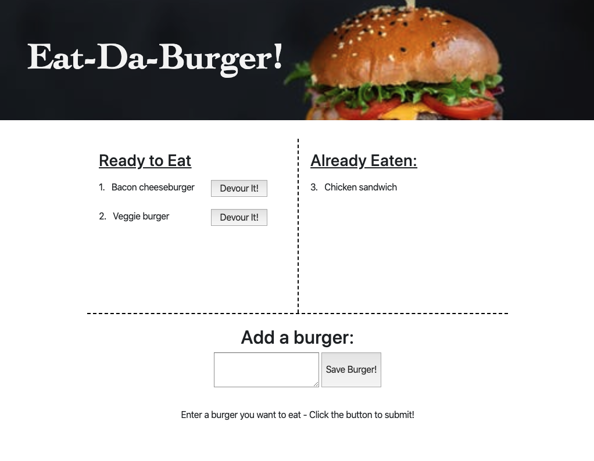

# Eat da Burger!
Unit 14: Node Express Handlebars HW
Coding Bootcamp Unit 14: Node Express Handlebars HW

## GitHub Repo:
https://github.com/pamelac08/burger

## Heroku Deployed Link:
https://young-lake-87321.herokuapp.com/

### Overview & Instructions
Eat-Da-Burger! is a single-page restaurant app that lets users input the names of burgers they'd like to eat.

* Whenever a user submits a burger's name, the app will display the burger on the left side of the page -- waiting to be devoured.
* Each burger in the waiting area has a Devour it! button. When the user clicks the button, the burger will move to the right side of the page and is no longer available to be devoured.

### Technical Description
* Primarily Bootstrap for basic styling
* Javascript/jQuery for logic on user input and get/post/pull requests from client-side
* Express Routers, Handlebars, ORM npm packages used to handle routing and follows the MVC design setup
* Data is stored and updated in a MySQL database
* The app is hosted/deployed via Heroku

In this assignment, you'll create a burger logger with MySQL, Node, Express, Handlebars and a homemade ORM (yum!). Be sure to follow the MVC design pattern; use Node and MySQL to query and route data in your app, and Handlebars to generate your HTML.

App screenshot

